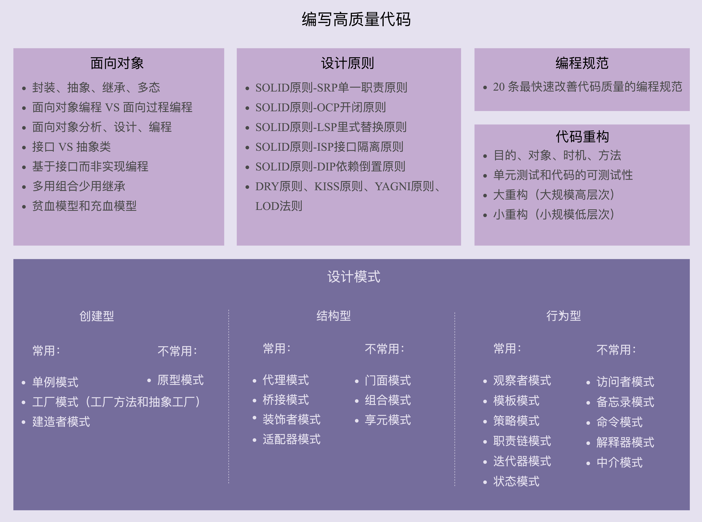
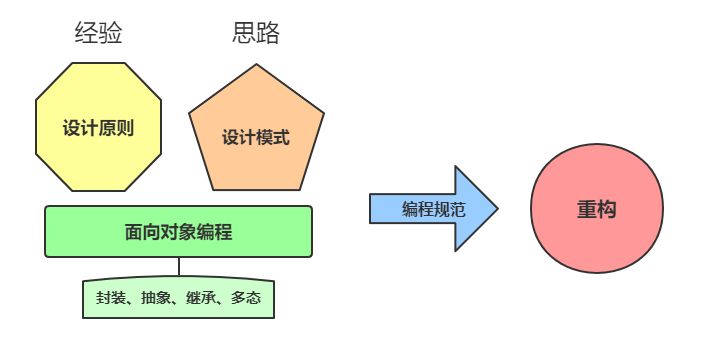

# 设计模式学习导读

## 如何评价代码质量的高低？

描述代码质量的常用词汇：

- 灵活性（flexibility）
- 可扩展性（extensibility）
- 可维护性（maintainability）
- 可读性（readability）
- 可理解性（understandability）
- 易修改性（changeability）
- 可复用（reusability）
- 可测试性（testability）
- 模块化（modularity）
- 高内聚低耦合（high cohesion loose coupling）
- 高效（high effciency）
- 高性能（high performance）
- 安全性（security）
- 兼容性（compatibility）
- 易用性（usability）
- 整洁（clean）
- 清晰（clarity）
- 简单（simple）
- 直接（straightforward）
- 少即是多（less code is more）
- 文档详尽（well-documented）
- 分层清晰（well-layered）
- 正确性（correctness、bug free）
- 健壮性（robustness）
- 鲁棒性（robustness）
- 可用性（reliability）
- 可伸缩性（scalability）
- 稳定性（stability）
- 优雅（elegant）
- 好（good）
- 坏（bad）

等等...

这里挑选其中最常用的、最重要的评价标准，来详细讲解，其中包括：

- 可维护行
- 可读性
- 可扩展性
- 灵活性
- 简洁性（简单、复杂）
- 可复用性
- 可测试性

### 可维护性（maintainability）

如果 bug 容易修复，修改、添加功能能够轻松完成，那我们就可以主观地认为代码对我们来说易维护。

相反，如果修改一个 bug，修改、添加一个功能，需要花费很长的时间，那我们就可以主观地认为代码对我们来说不易维护。

> 代码质量的评价有很强的主观性。

### 可读性（readability）

> 软件设计大师 Martin Fowler 曾经说过：
>
> “Any fool can write code that a computer can understand. 
>
> Good programmers write code that humans can understand.”
>
> 翻译成中文就是：“任何傻瓜都会编写计算机能理解的代码。好的程序员能够编写人能够理解的代码。”

code review 是一个很好的测验代码可读性的手段。如果你的同事可以轻松地读懂你写的代码，那说明你的代码可读性很好；如果同事在读你的代码时，有很多疑问，那就说明你的代码可读性有待提高了。

### 可扩展性（extensibility）

代码是否易扩展也很大程度上决定代码是否易维护。

代码的可扩展性表示，我们在不修改或少量修改原有代码的情况下，通过扩展的方式添加新的功能代码。说直白点就是，代码预留了一些功能**扩展点**，你可以把新功能代码，直接插到扩展点上，而不需要因为要添加一个功能而大动干戈，改动大量的原始代码。

### 灵活性（flexibility）

什么情况下我们才会说代码写得好灵活呢？

- 易扩展：当添加新功能时，原有代码已预留好扩展点。
- 易复用：实现一个功能是，原有代码已经抽象出了很多底层的可复用模块、类等代码。
- 易使用：当使用某组接口，这组接口可以应对各种使用场景，满足不同的需求。

### 简洁性（simplicity）

> KISS 原则：“Keep It Simple，Stupid”。
>
> 这个原则说的意思就是，尽量保持代码简单。代码简单、逻辑清晰，也就意味着易读、易维护。

很多编程经验不足的程序员会觉得，简单的代码没有技术含量，喜欢在项目中引入一些复杂的设计模式，觉得这样才能体现自己的技术水平。实际上，**思从深而行从简，真正的高手能云淡风轻地用最简单的方法解决最复杂的问题。这也是一个编程老手跟编程新手的本质区别之一。**

### 可复用性（reusability）

代码的可复用性可以简单地理解为，尽量减少重复代码的编写，复用已有的代码。比如：

- 面向对象的继承、多态
- 设计原则的单一职责原则
- 重构技巧中的解耦、高内聚、模块化等

> 代码可复用性跟 DRY（Don’t Repeat Yourself）这条设计原则的关系挺紧密的。

### 可测试性（testability）

代码的可测试性是一个相对较少被提及，但又非常重要的代码质量评价标准。

代码可测试性的好坏，能从侧面上非常准确地反应代码质量的好坏。

代码的可测试性差，比较难写单元测试，那基本上就能说明代码设计得有问题。

## 面向对象、设计原则、设计模式、编程规范、重构五者的关系

### 面向对象

面向对象编程具有丰富的特性，可以实现很多复杂的设计思路，是很多设计原则、设计模式编码实现的基础。面向对象编程的 7 大知识点：

- 四大特征：封装、抽象、继承、多态
- 面向对象编程与面向过程编程的区别和联系
- 面向对象分析、面向对象设计、面向对象编程
- 接口和抽象类的区别以及各自的应用场景
- 基于接口而非实现编程的设计思想
- 多用组合少用继承的设计思想
- 面向过程的贫血模型和面型对象的充血模型

### 设计原则

设计原则是指导代码设计的一些经验总结。每一种设计原则，我们需要掌握它的设计初衷，解决哪些编程问题，有哪些应用场景。常用的设计原则：

- SOLID 原则
  - SRP 单一职责原则
  - OCP 开闭原则
  - LSP 里式替换原则
  - ISP 接口隔离原则
  - DIP 依赖倒置原则
- DYR 原则
- KISS 原则
- YAGNI 原则
- LOD 法则

### 设计模式

设计模式是针对软件开发中经常遇到的一些设计问题，总结出来的一套解决方案或者设计思路。
大部分设计模式解决的都是代码可扩展性问题。
了解它们都能解决哪些问题，掌握典型的应用场景，懂得不过度应用。

经典的设计模式有 23 种。
随着编程语言的演进：

- 一些设计模式（比如 Singleton）随之过时，成了反模式
- 一些被内置在编程语言中（比如 Iterator）
- 还有一些新的模式诞生（比如 Monostate）

23种经典设计模式分类：

- **创建型**
  - 常用：单例模式、工厂模式（工厂方法和抽象工厂）、建造者模式
  - 不常用：原型模式
- **结构型**
  - 常用：代理模式、桥接模式、装饰着模式、适配器模式
  - 不常用：门面模式、组合模式、享元模式
- **行为型**
  - 常用：观察者模式、，模板模式、策略模式、职责链模式、迭代器模式、状态模式
  - 不常用：访问者模式、备忘录模式、命令模式、解释器模式、中介模式

### 编程规范

编程规范主要解决的是代码可读性问题。对于编码规范，很多书籍已经讲得很好了（比如《重构》《代码大全》《代码整洁之道》等）。专栏将编程规范跟重构放到了一起，之所以这样做，是因为重构分为大重构和小重构 2 种类型，小重构利用的知识基本上就是编码规范。

### 代码重构

重构是软件开发中非常重要的一个环节，持续重构是保持代码质量不下降的有效手段，能有效避免代码腐化到无可救药的地步。

重构的工具：

- 面向对象设计思想
- 设计原则
- 设计模式
- 编码规范

> 实际上，设计思想、设计原则、设计模式一个最重要的应用场景就是在重构的时候。
>
> 使用设计模式可以提高代码的可扩展性，但过度不恰当地使用，也会增加代码的复杂度，影响代码的可读性。
> 在开发初期，除非特别必须，一定不要过度设计，应用复杂的设计模式。
> 当代码出现问题的时候，针对问题，应用原则和模式进行重构，这样就能有效避免前期的过度设计。

重构内容的知识点：

- 重构的目的（why）、对象（what）、时机（when）、方法（how）
- 保证重构不出错的技术手段：单元测试和代码的可测试性
- 2 种不同规模的重构：
  - 大重构：大规模高层次
  - 小重构：小规模底层次

### 五者之间的联系

关于 面向对象、设计原则、设计模式、编程规范 和 代码重构，这五者的关系总结梳理：

- **面向对象编程**因为其具有丰富的特性（封装、抽象、继承、多态），可以实现很多复杂的设计思路，**是很多设计原则、设计模式等编码实现的基础**。
- **设计原则是指导代码设计的一些经验总结**，对于某些场景下，是否应该应用某种设计模式，具有指导意义。比如，“开闭原则”是很多设计模式（策略、模板等）的指导原则。
- **设计模式是针对软件开发中经常遇到的一些设计问题，总结出来的一套解决方案或者设计思路**。应用设计模式的主要目的是提高代码的可扩展性。从抽象程度上来讲，设计原则比设计模式更加抽象。设计模式更加具体、更加可执行。
- **编程规范主要解决的是代码的可读性问题**。编码规范相对于设计原则、设计模式，更加具体、更加偏重代码细节、更加能落地。持续的小重构依赖的理论基础主要就是编程规范。
- **重构作为保持代码质量不下降的有效手段**，利用的就是面向对象、设计原则、设计模式、编码规范这些理论。

实际上，面向对象、设计原则、设计模式、编码规范、代码重构，这五者都是保持或者提高代码质量的方法论，本质上都是服务于编写高质量代码这一件事的。

